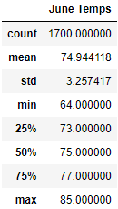
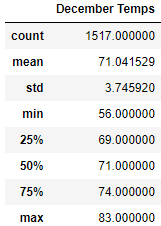

# surfs_up

## Overview
For this project, we have teamed up with another ficticious invester with the goal of opening a surf and ice cream shop in Hawaii.  The purpose of this analysis was to review weather data on the island of Oahu and create summary statistics so that our investing partner can use that information to determine if Oahu is a suitable location to open a surf and ice cream shop.  Our investing partner wanted to determine if the surf and ice cream shop business would be sustainable year-round and he specifically requested temperature data for the months of June and December.
## Results
One thing that is important to us as investors is that our surf and ice cream shop is able to operate year-round without needing to have seasonal closings due to weather.  Our investment team believes that people will eat more ice cream and do more surfing when it's sunny out and temperatures are warmer so ideally, we would like to open our surf and ice cream shop in a location where the temperature is warm all year and doesn't fluctuate drastically.  The results of our summary statistics for the months of June and December are displayed below.

The summary statistics data for June and December provides important information that both supports and opposes opening a surf and ice cream shop in Oahu.
- The max temperatures for June and December are within two degrees
- The mean temperatures for June and December are less than four degrees difference
- The standard deviation of temperatures for June and December is less than half a degree difference
- The minimum temperature in December was eight degrees colder than the minimum temperature in June
## Summary
From our summary statistics we see that the maximum temperatures and the mean temperatures for June and December are very close which supports the argument for choosing Oahu as our future business location.  Looking specifically at the December temperature data, we see that the minimum temperature recorded was 56 degrees; this seems a bit chilly for surfing and ice cream, but we know it doesn't typically stay that cold in December because from our summary statistics we can see that for 75% of the month the temperature is 69 degrees or higher.  Before making a final decision on our investment, there is some additional analysis that could be performed to help us make a more informed decision.  We know that the weather data is gathereed from multiple weather stations on Oahu and in order to really focus in on our future business location, it would be beneficial to analyze the temperature data and group that data by weather station; this would help us determine if there are significant temperature differences in different locations of the island (i.e. North shore vs South shore or shoreline vs island interior).  Before making any investment decisions, it would also be beneficial to get the data and perform an analysis on precipitation since rain can have a significant effect on whether people want to go surfing and/or eat ice cream.